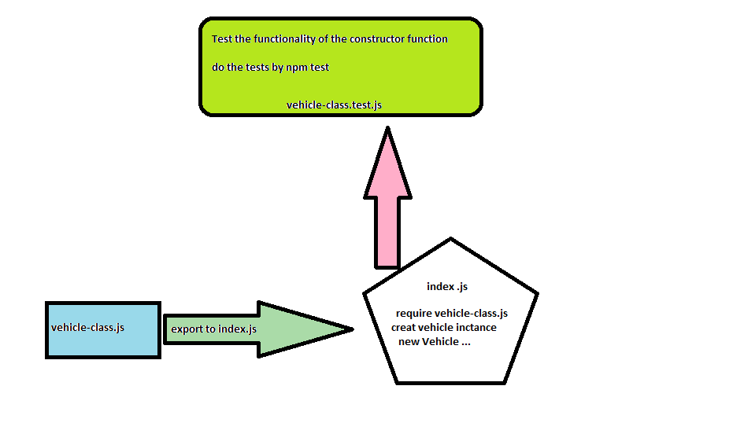

# LAB - Class 02

## Classes

### Author: obada al-quran

### Links and Resources

- [submission PR](https://github.com/obadeh/401-lab-02/pull/1)
- [ci/cd](https://github.com/obadeh/401-lab-02/actions) (GitHub Actions)

#### How to initialize/run your application (where applicable)

- e.g. `npm start`

#### Tests

- How do you run tests? `npm test`
- Any tests of note?
- Describe any tests that you did not complete, skipped, etc

#### UML

